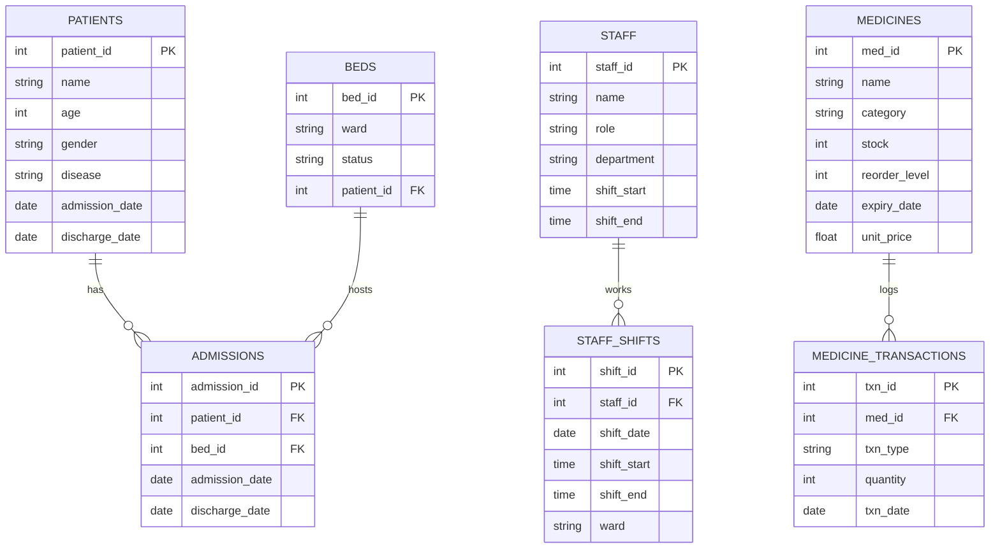

# Entity-Relationship Diagram

**Why `ADMISSIONS` exists separately from `PATIENTS`/`BEDS`:** a patient
can (in theory) be re-admitted, and a bed's occupancy history needs to be
queryable over time — not just "who's in it right now." `PATIENTS.admission_date`
/`discharge_date` covers the simple case; `ADMISSIONS` is the full history table
the analytics (occupancy trends, length-of-stay) actually query against.
